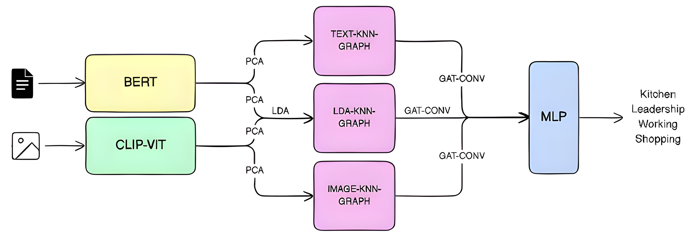

# Multi-Graph Contextual Learning for Multimodal Meme Classification

## Model Architecture  

## Evaluation Metrics  

| Model | Accuracy | Precision | Recall | Macro F1 | Weighted F1 |
|------|----------|----------|--------|----------|-------------|
| LDA Graph | 0.9484 | 0.9140 | 0.9102 | 0.9106 | 0.9481 |
| PCA (Two Modalities) | 0.9507 | 0.9271 | 0.8965 | 0.9099 | 0.9491 |
| Three-Graph Integration | 0.9484 | 0.9003 | 0.9028 | 0.9015 | 0.9485 |