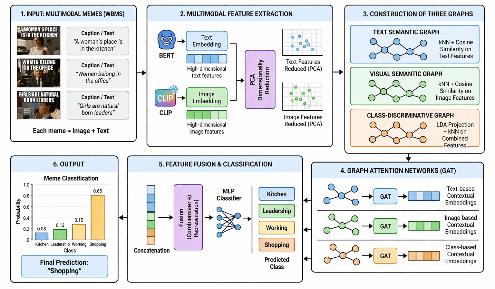

# Multi-Graph Contextual Learning for Multimodal Meme Classification

## Model Architecture  



## Evaluation Metrics  

| Model | Accuracy | Precision | Recall | Macro F1 | Weighted F1 |
|------|----------|----------|--------|----------|-------------|
| LDA Graph | 0.9484 | 0.9140 | 0.9102 | 0.9106 | 0.9481 |
| PCA (Two Modalities) | 0.9507 | 0.9271 | 0.8965 | 0.9099 | 0.9491 |
| Three-Graph Integration | 0.9484 | 0.9003 | 0.9028 | 0.9015 | 0.9485 |

## Streamlit App

The repository now includes a Streamlit interface for:

- project overview and dataset summary
- architecture explanation for the multimodal graph pipeline
- experiment comparison from saved training logs
- inference on project samples or uploaded image-caption pairs

Run it with:

```bash
./venv/bin/streamlit run streamlit_app.py
```

If you are not using the bundled virtual environment, install dependencies first:

```bash
pip install -r requirements.txt
streamlit run streamlit_app.py
```
